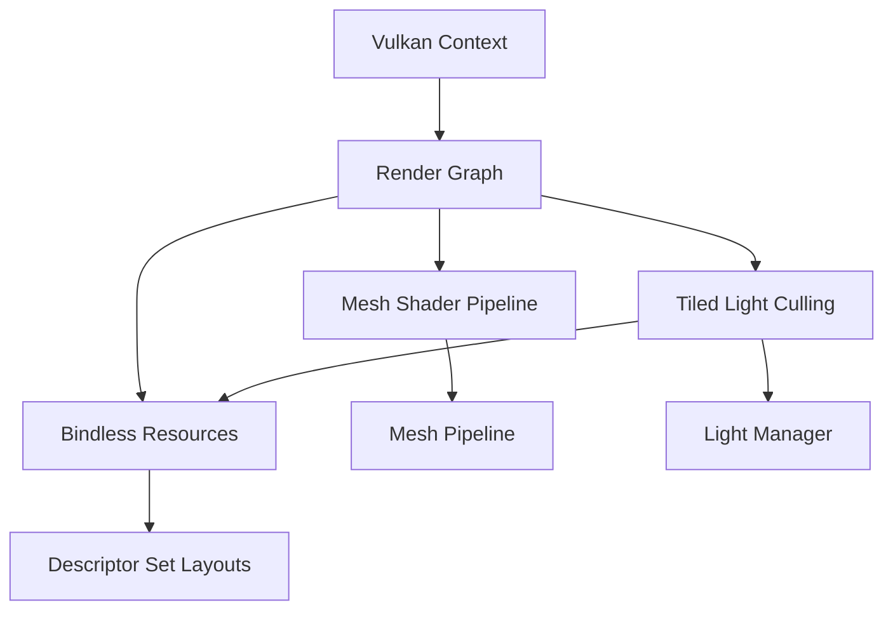

# Njulf Framework - System Architecture

## Core Components

### 1. Vulkan Context
- **Purpose**: Manages Vulkan instance, physical/ logical devices, and memory allocator
- **Key Features**:
  - Instance creation with validation layers
  - Physical device selection and queue family discovery
  - Logical device creation with required extensions
  - VMA allocator for memory management
- **Implementation**: [`Njulf Framework.Rendering/Core/VulkanContext.cs`](Njulf Framework.Rendering/Core/VulkanContext.cs)

### 2. Render Graph System
- **Purpose**: Manages render passes and their execution order
- **Key Features**:
  - Dynamic pass scheduling based on frame requirements
  - Automatic barrier insertion between passes
  - Support for both graphics and compute passes
  - Dependency tracking for resource transitions
- **Implementation**: [`Njulf Framework.Rendering/Pipeline/RenderGraph.cs`](Njulf Framework.Rendering/Pipeline/RenderGraph.cs)

### 3. Bindless Resource System
- **Purpose**: Enables efficient resource binding without descriptor set limitations
- **Key Features**:
  - Single large binding per descriptor set type
  - Supports 65,536 buffers and 65,536 textures
  - Uses VK_KHR_bind_memory2 extension
  - Custom allocator for descriptor indices
- **Implementation**: [`Njulf Framework.Rendering/Resources/Descriptors/BindlessDescriptorHeap.cs`](Njulf Framework.Rendering/Resources/Descriptors/BindlessDescriptorHeap.cs)

### 4. Mesh Shader Pipeline
- **Purpose**: Modern geometry processing pipeline
- **Key Features**:
  - Task and mesh shader support (VK_EXT_mesh_shader)
  - Replaces traditional vertex/fragment pipelines
  - Better performance for complex geometry
  - Reduced CPU-GPU synchronization
- **Implementation**: [`Njulf Framework.Rendering/Pipeline/DynamicMeshPass.cs`](Njulf Framework.Rendering/Pipeline/DynamicMeshPass.cs)

### 5. Tiled Light Culling
- **Purpose**: Efficient light source management
- **Key Features**:
  - Compute shader-based light culling
  - Tiled forward+ rendering approach
  - Supports thousands of dynamic lights
  - Integrates with bindless resources
- **Implementation**: [`Njulf Framework.Rendering/Pipeline/TiledLightCullingPass.cs`](Njulf Framework.Rendering/Pipeline/TiledLightCullingPass.cs)

## Component Relationships

## Key Technical Decisions

### 1. Bindless Resource Model
- **Approach**: Solution 1 (Single Large Binding)
- **Rationale**: Best performance for scenes with many draw calls
- **Implementation**: Two descriptor sets:
  - Set 0: 65,536 storage buffers
  - Set 1: 65,536 combined image samplers

### 2. Dynamic Render Graph
- **Approach**: Simple sequential execution with automatic barriers
- **Rationale**: Flexibility for different rendering techniques
- **Future Work**: Add explicit dependency tracking for optimal scheduling

### 3. Mesh Shaders
- **Approach**: VK_EXT_mesh_shader extension
- **Rationale**: Better performance for complex geometry
- **Fallback**: Traditional vertex/fragment pipelines when not supported

### 4. Memory Management
- **Approach**: VMA with custom defragmentation
- **Rationale**: Predictable performance with large asset streams
- **Implementation**: Defragmentation-on-demand to prevent stalls

## Critical Implementation Paths

1. **Initialization Sequence**:
   - VulkanContext.Create()
   - DescriptorSetLayouts.Create()
   - BindlessDescriptorHeap.Create()
   - RenderGraph.AddPasses()

2. **Frame Execution**:
   - RenderGraph.Execute()
   - Each pass records commands
   - Automatic barrier insertion
   - Resource transitions handled

3. **Resource Management**:
   - BufferManager.Allocate()
   - TextureManager.Create()
   - DescriptorAllocator.Assign()

## Design Patterns

1. **Resource Handles**: Lightweight references to GPU resources
2. **Command Pattern**: Render passes encapsulate recording logic
3. **Factory Pattern**: Pipeline creation and resource allocation
4. **Observer Pattern**: Event system for resource changes