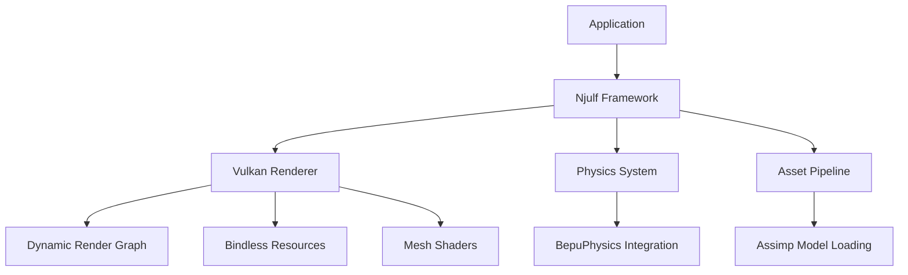

# Njulf Framework - Product Overview

## Why This Project Exists
Njulf Framework addresses the gap between monolithic game engines and bare-metal GPU APIs by providing a **high-performance, modular rendering framework** that:
- Enables **custom engine development** without the overhead of Unity/Unreal
- Offers **fine-grained control** over rendering pipelines while abstracting Vulkan boilerplate
- Supports **next-gen rendering techniques** (mesh shaders, bindless resources, hybrid lighting)
- Maintains **C# productivity** while delivering native-level performance

## Problems It Solves
1. **Vulkan Complexity**: Abstracts low-level Vulkan management while exposing full capability
2. **Descriptor Bottlenecks**: Implements bindless resource model for 10,000+ draw calls/frame
3. **Pipeline Flexibility**: Dynamic render graph adapts to scene complexity at runtime
4. **Memory Fragmentation**: Custom allocator with defragmentation-on-demand prevents stalls
5. **Cross-Platform Development**: Single codebase targets Windows/Linux/mobile GPUs

## How It Should Work
### Core Workflow

### Key Features in Action
1. **Dynamic Render Graph**: Automatically schedules passes and barriers based on frame requirements
2. **Hybrid Lighting**: Combines tiled forward+ with ray-traced shadows/reflections
3. **Asset Pipeline**: Seamless GLTF/FBX import via Silk.NET.Assimp
4. **Memory Management**: Deterministic allocation with defragmentation

## User Experience Goals
- **Developers**: 
  - Write rendering code in C# with IDE support
  - Hot-reload shaders during development
  - Debug with RenderDoc integration
  - Scale from prototypes to production

- **End Users**:
  - Consistent 60+ FPS on mid-range hardware
  - High-fidelity visuals with adaptive quality
  - Low latency in VR/AR applications

## Target Audience
- Game developers building custom engines
- Simulation developers needing high-performance rendering
- Researchers implementing novel rendering techniques
- Educators teaching advanced computer graphics