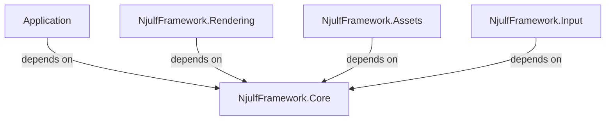

# NjulfFramework.Core Structure Documentation

## Overview

The `NjulfFramework.Core` project provides shared interfaces, enums, and base classes that can be used across all modules in the NjulfFramework ecosystem. This design follows SOLID principles and supports dependency injection, enabling loose coupling between modules.

## Project Structure

```
NjulfFramework.Core/
├── Enums/
│   ├── AlphaMode.cs
│   └── PrimitiveMode.cs
├── Interfaces/
│   ├── Assets/
│   │   ├── IAsset.cs
│   │   ├── IAssetLoader.cs
│   │   └── IModel.cs
│   ├── Conversion/
│   │   └── IModelConverter.cs
│   ├── Rendering/
│   │   ├── IMaterial.cs
│   │   ├── IMesh.cs
│   │   ├── IRenderable.cs
│   │   └── IRenderer.cs
│   └── Scene/
│       ├── IScene.cs
│       └── ISceneNode.cs
└── NjulfFramework.Core.csproj
```

## Interfaces

### Rendering Interfaces

#### `IRenderer`
Main interface for rendering operations with async support:
- `InitializeAsync()` - Initialize the renderer
- `RenderFrameAsync()` - Render a frame
- `Resize(int width, int height)` - Handle window resize

#### `IRenderable`
Interface for objects that can be rendered:
- `Name` - Identifier for the renderable
- `Transform` - Transformation matrix
- `Update(double deltaTime)` - Update method

#### `IMaterial`
Interface for material definitions:
- `Name` - Material name
- `ShaderPath` - Path to shader
- Common material properties

#### `IMesh`
Interface for mesh data:
- `Name` - Mesh name
- `Bounds` - Bounding box
- `MaterialName` - Associated material
- Mesh data access methods

### Asset Interfaces

#### `IAsset`
Base interface for all assets:
- `Name` - Asset name
- `SourcePath` - Source file path
- Inherits from `IDisposable`

#### `IModel`
Interface for 3D models:
- Inherits from `IAsset`
- `Meshes` - Collection of meshes
- `Materials` - Collection of materials

#### `IAssetLoader`
Interface for asset loading:
- `LoadModelAsync(string filePath, CancellationToken)` - Async model loading
- `GetCachedModel(string filePath)` - Get cached model
- `ClearCache()` - Clear asset cache
- `LoadProgress` event - Progress reporting

### Scene Interfaces

#### `IScene`
Interface for scene management:
- `Renderables` - Collection of renderable objects
- `AddRenderable(IRenderable)` - Add object to scene
- `RemoveRenderable(IRenderable)` - Remove object from scene

#### `ISceneNode`
Interface for scene hierarchy:
- `Name` - Node name
- `Transform` - Transformation matrix
- `Parent` - Parent node
- `Children` - Child nodes

### Conversion Interfaces

#### `IModelConverter`
Interface for model conversion:
- `ConvertToRenderables(IModel)` - Convert model to renderable objects

## Enums

### `PrimitiveMode`
Enum for rendering primitive types:
- `Points`
- `Lines`
- `LineStrip`
- `Triangles`
- `TriangleStrip`
- `TriangleFan`

### `AlphaMode`
Enum for alpha blending modes:
- `Opaque` - No transparency
- `Mask` - Cutout transparency
- `Blend` - Semi-transparent

## Design Principles

### SOLID Principles

1. **Single Responsibility**: Each interface has a single, well-defined responsibility
2. **Open/Closed**: Interfaces are open for extension but closed for modification
3. **Liskov Substitution**: Interfaces can be substituted with any implementation
4. **Interface Segregation**: Small, focused interfaces rather than large monolithic ones
5. **Dependency Inversion**: High-level modules depend on abstractions, not concretions

### Dependency Injection Support

All interfaces are designed to work seamlessly with dependency injection containers:
- Constructor injection pattern
- Interface-based dependencies
- Easy mocking for unit testing

## Usage Patterns

### Typical Dependency Flow



### Example DI Setup

```csharp
// Register services
services.AddSingleton<IRenderer, VulkanRenderer>();
services.AddSingleton<IAssetLoader, AssetLoader>();
services.AddSingleton<IModelConverter, RendererAdapter>();
services.AddSingleton<IScene, Scene>();

// Resolve and use
var renderer = serviceProvider.GetRequiredService<IRenderer>();
var assetLoader = serviceProvider.GetRequiredService<IAssetLoader>();
```

## Benefits

1. **Reduced Coupling**: Modules depend only on Core interfaces
2. **Improved Testability**: Easy to mock dependencies for unit testing
3. **Better Modularity**: Can swap implementations (e.g., different renderers)
4. **Clearer Architecture**: Explicit dependencies through DI
5. **Easier Maintenance**: Changes in one module don't cascade to others

## Implementation Notes

### Interface Naming Convention

- All interfaces start with 'I' prefix
- Interfaces are organized by functional area (Rendering, Assets, Scene, etc.)
- Interface names reflect their primary responsibility

### Versioning Strategy

The Core project should follow semantic versioning:
- Major version changes for breaking interface changes
- Minor version changes for backward-compatible additions
- Patch version changes for bug fixes

### Future Extensions

The interface-based design allows for future extensions such as:
- Additional rendering backends (DirectX, Metal, etc.)
- New asset formats and loaders
- Extended scene management features
- Additional conversion pipelines

## Migration Guide

For existing code that directly references concrete types:

1. Identify direct type dependencies
2. Replace with corresponding interface
3. Update constructor injection
4. Implement interface methods as needed
5. Test with mock implementations

## Conclusion

The `NjulfFramework.Core` project establishes a solid foundation for the entire framework by providing well-designed interfaces and shared types that enable loose coupling, better testability, and improved modularity across all modules.