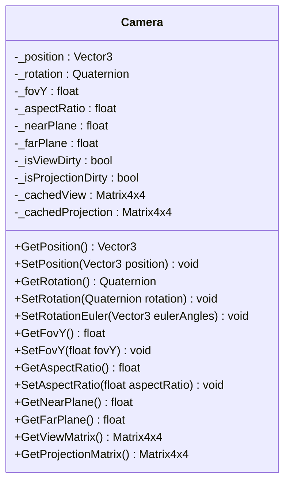

# Camera System Design

## Overview
A minimalist, high-performance **Camera** system for the **NjulfFramework.Rendering** project, adhering to strict requirements for encapsulation, immutability, and performance.

---

## Dependencies
- **Math Primitives**: `System.Numerics` (`Vector3`, `Quaternion`, `Matrix4x4`)
- **Core Project**: Fully owned by `NjulfFramework.Rendering`

---

## Class Structure


---

## Properties and Methods

### Core Properties
| Property          | Type         | Access          | Notes                                                                                     |
|-------------------|--------------|-----------------|-------------------------------------------------------------------------------------------|
| `Position`        | `Vector3`    | Get/Set         | Immutable by default; explicit setter required.                                          |
| `Rotation`        | `Quaternion` | Get/Set         | Normalized automatically. Euler angles supported via `SetRotationEuler`.                |
| `FovY`            | `float`      | Get/Set         | Vertical FOV in radians, clamped to `[0.1, π/2]`.                                        |
| `AspectRatio`     | `float`      | Get/Set         | Defaults to `1.0f`; triggers projection matrix recalculation.                           |
| `NearPlane`       | `float`      | Get             | Fixed at `0.1f` (immutable).                                                             |
| `FarPlane`        | `float`      | Get             | Fixed at `1000.0f` (immutable).                                                          |

### Matrices
| Method                     | Return Type    | Notes                                                                                     |
|----------------------------|----------------|-------------------------------------------------------------------------------------------|
| `GetViewMatrix()`          | `Matrix4x4`    | Lazy-evaluated; cached until position/rotation changes.                                  |
| `GetProjectionMatrix()`   | `Matrix4x4`    | Lazy-evaluated; cached until FOV/aspect/resolution changes. Supports perspective only.   |

---

## Behavioral Constraints

### Immutability
- All properties require explicit mutation (e.g., `SetPosition()`).
- No public fields or direct property setters.

### Validation
- **Debug Builds**: Assertions for NaN/infinite values in setters.
- **Release Builds**: Silent clamping/sanitization (e.g., negative FOV → `0.1`).

### Thread Safety
- **Read Operations**: Safe for concurrent access (no locks).
- **Write Operations**: Require external synchronization (caller’s responsibility).

### Performance
- **Lazy Evaluation**: Matrices recalculated only when:
  - `GetViewMatrix()` called after position/rotation changes.
  - `GetProjectionMatrix()` called after FOV/aspect/resolution changes.
- **SIMD-Friendly**: Uses `System.Numerics` for quaternion/vector operations.
- **Zero Allocations**: No dynamic allocations post-initialization.

---

## Implementation Notes

### Matrix Caching
```csharp
private bool _isViewDirty = true;
private bool _isProjectionDirty = true;
private Matrix4x4 _cachedView;
private Matrix4x4 _cachedProjection;

public Matrix4x4 GetViewMatrix()
{
    if (_isViewDirty)
    {
        _cachedView = Matrix4x4.CreateLookAt(Position, Position + Forward, Up);
        _isViewDirty = false;
    }
    return _cachedView;
}
```

### Euler Angle Conversion
```csharp
public void SetRotationEuler(Vector3 eulerAngles)
{
    Quaternion newRotation = Quaternion.CreateFromYawPitchRoll(
        eulerAngles.Y, 
        eulerAngles.X, 
        eulerAngles.Z
    );
    SetRotation(newRotation);
}
```

### FOV Clamping
```csharp
public void SetFovY(float fovY)
{
    _fovY = Math.Clamp(fovY, 0.1f, MathF.PI / 2f);
    _isProjectionDirty = true;
}
```

---

## Error Handling
| Scenario               | Debug Build          | Release Build                |
|------------------------|-----------------------|------------------------------|
| NaN/Infinite Input     | `Debug.Assert`        | Silent no-op                 |
| Invalid FOV (< 0.1)    | `Debug.Assert`        | Clamped to `0.1f`            |
| Invalid FOV (> π/2)    | `Debug.Assert`        | Clamped to `π/2`             |

---

## Extensibility
- **No Virtual Methods**: Use composition for future features (e.g., `CameraController` for movement logic).
- **No Serialization**: Storage/loading is the caller’s responsibility.
- **No Defaults**: Construction requires explicit position/rotation/FOV.

---

## Public API Example
```csharp
// Create a camera
var camera = new Camera(
    position: new Vector3(0, 0, -5),
    rotation: Quaternion.Identity,
    fovY: MathF.PI / 4f,  // 45°
    aspectRatio: 16f / 9f
);

// Update properties
camera.SetPosition(new Vector3(1, 2, 3));
camera.SetRotationEuler(new Vector3(0, MathF.PI / 2, 0));  // 90° yaw

// Access matrices (lazy-evaluated)
Matrix4x4 view = camera.GetViewMatrix();
Matrix4x4 projection = camera.GetProjectionMatrix();
```

---

## Threading Model
- **Read-Only Operations**: Safe for concurrent access (e.g., `GetViewMatrix()`).
- **Mutations**: Require external synchronization (e.g., lock or single-threaded context).

```csharp
// Example: Thread-safe mutation
lock (cameraLock)
{
    camera.SetPosition(newPosition);
    camera.SetRotation(newRotation);
}
```

---

## Integration Points
- **Rendering Pipeline**: Consumes `GetViewMatrix()` and `GetProjectionMatrix()`.
- **Scene System**: Provides camera position/rotation for culling or effects.
- **Input System**: Optional `CameraController` composes with `Camera` for user-driven movement.

---

## Open Questions
1. Should `NearPlane`/`FarPlane` be configurable, or fixed as shown?
2. Is the default aspect ratio (`1.0f`) sufficient, or should it derive from the swapchain?
3. Should Euler angle support use radians or degrees for consistency with FOV?