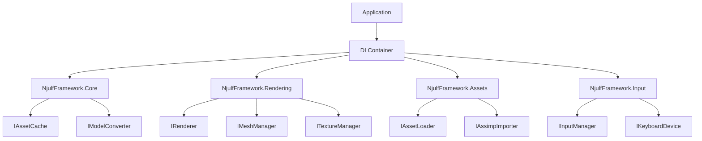

# Dependency Injection Usage Patterns for NjulfFramework

## Overview

This document provides comprehensive documentation on how to use the dependency injection (DI) pattern implemented in NjulfFramework. The DI system is built using Microsoft.Extensions.DependencyInjection and provides a modular, testable architecture.

## Basic Setup

### 1. Setting up the DI Container

The basic setup involves creating a service collection and adding the required framework modules:

```csharp
using Microsoft.Extensions.DependencyInjection;
using NjulfFramework.Core.DependencyInjection;
using NjulfFramework.Rendering.DependencyInjection;
using NjulfFramework.Assets.DependencyInjection;
using NjulfFramework.Input.DependencyInjection;

// Create service collection
var services = new ServiceCollection();

// Add framework modules
services.AddNjulfFrameworkCore()
        .AddNjulfFrameworkRendering()
        .AddNjulfFrameworkAssets()
        .AddNjulfFrameworkInput();

// Build service provider
var serviceProvider = services.BuildServiceProvider();
```

### 2. Module-Specific Extensions

Each module provides its own extension methods for service registration:

#### Core Module
```csharp
services.AddNjulfFrameworkCore();
// Registers: IAssetCache, IModelConverter
```

#### Rendering Module
```csharp
services.AddNjulfFrameworkRendering();
// Registers: IRenderer, IMeshManager, ITextureManager, ISceneDataBuilder
```

#### Assets Module
```csharp
services.AddNjulfFrameworkAssets();
// Registers: IAssetLoader, IAssimpImporter, ITextureLoader
```

#### Input Module
```csharp
services.AddNjulfFrameworkInput();
// Registers: IInputManager, IKeyboardDevice, IMouseDevice
```

## Service Resolution

### 1. Resolving Services

Services can be resolved using the service provider:

```csharp
// Resolve individual services
var renderer = serviceProvider.GetRequiredService<IRenderer>();
var assetLoader = serviceProvider.GetRequiredService<IAssetLoader>();
var inputManager = serviceProvider.GetRequiredService<IInputManager>();

// Resolve all services of a type
var allRenderables = serviceProvider.GetServices<IRenderable>();
```

### 2. Constructor Injection

Components should use constructor injection to receive their dependencies:

```csharp
public class GameScene
{
    private readonly IRenderer _renderer;
    private readonly IAssetLoader _assetLoader;
    private readonly IInputManager _inputManager;
    
    public GameScene(IRenderer renderer, IAssetLoader assetLoader, IInputManager inputManager)
    {
        _renderer = renderer;
        _assetLoader = assetLoader;
        _inputManager = inputManager;
    }
    
    // Use injected services
}
```

## Service Lifetimes

The framework uses three types of service lifetimes:

### 1. Singleton Services

Services that maintain state and should be shared across the application:

```csharp
// Registration
services.AddSingleton<IRenderer, VulkanRenderer>();
services.AddSingleton<IAssetCache, AssetCache>();

// Usage - same instance throughout application lifetime
var renderer1 = serviceProvider.GetRequiredService<IRenderer>();
var renderer2 = serviceProvider.GetRequiredService<IRenderer>();
// renderer1 == renderer2
```

### 2. Transient Services

Stateless services that should be created each time they're requested:

```csharp
// Registration
services.AddTransient<IModelConverter, RendererAdapter>();

// Usage - new instance each time
var converter1 = serviceProvider.GetRequiredService<IModelConverter>();
var converter2 = serviceProvider.GetRequiredService<IModelConverter>();
// converter1 != converter2
```

### 3. Scoped Services (Not Typically Used)

The framework doesn't typically use scoped services as it's not a web application.

## Advanced Usage Patterns

### 1. Custom Service Registration

You can register your own implementations:

```csharp
// Register custom renderer
services.AddSingleton<IRenderer, MyCustomRenderer>();

// Register custom asset loader
services.AddSingleton<IAssetLoader, MyAssetLoader>();
```

### 2. Factory Pattern

For complex object creation:

```csharp
public class SceneFactory
{
    private readonly IServiceProvider _serviceProvider;
    
    public SceneFactory(IServiceProvider serviceProvider)
    {
        _serviceProvider = serviceProvider;
    }
    
    public IScene CreateScene(string sceneType)
    {
        return sceneType switch
        {
            "main" => _serviceProvider.GetRequiredService<MainScene>(),
            "menu" => _serviceProvider.GetRequiredService<MenuScene>(),
            _ => throw new ArgumentException("Unknown scene type")
        };
    }
}
```

### 3. Lazy Initialization

For expensive services that may not be needed immediately:

```csharp
public class GameManager
{
    private readonly Lazy<IAssetLoader> _assetLoader;
    
    public GameManager(IServiceProvider serviceProvider)
    {
        _assetLoader = new Lazy<IAssetLoader>(() => serviceProvider.GetRequiredService<IAssetLoader>());
    }
    
    public void LoadAssets()
    {
        // Asset loader is only created when first used
        var loader = _assetLoader.Value;
        // Use loader...
    }
}
```

## Testing with Dependency Injection

### 1. Unit Testing with Mocks

The DI pattern makes unit testing much easier:

```csharp
[Test]
public async Task AssetLoader_ShouldCacheModels()
{
    // Arrange
    var mockImporter = new Mock<IAssimpImporter>();
    var mockConverter = new Mock<IModelConverter>();
    var mockCache = new Mock<IAssetCache>();
    
    var services = new ServiceCollection();
    services.AddSingleton(mockImporter.Object);
    services.AddSingleton(mockConverter.Object);
    services.AddSingleton(mockCache.Object);
    
    var serviceProvider = services.BuildServiceProvider();
    var assetLoader = new AssetLoader(serviceProvider);
    
    // Act
    await assetLoader.LoadModelAsync("test.gltf");
    
    // Assert
    mockCache.Verify(c => c.AddModel("test.gltf", It.IsAny<IModel>()), Times.Once);
}
```

### 2. Integration Testing

Test the complete DI setup:

```csharp
[Test]
public void DI_Container_ShouldResolveAllServices()
{
    // Arrange
    var services = new ServiceCollection();
    services.AddNjulfFrameworkCore()
            .AddNjulfFrameworkRendering()
            .AddNjulfFrameworkAssets()
            .AddNjulfFrameworkInput();
    
    var provider = services.BuildServiceProvider();
    
    // Act & Assert
    Assert.NotNull(provider.GetService<IRenderer>());
    Assert.NotNull(provider.GetService<IAssetLoader>());
    Assert.NotNull(provider.GetService<IInputManager>());
    Assert.NotNull(provider.GetService<IModelConverter>());
}
```

## Common Patterns

### 1. Service Locator Pattern (Anti-Pattern)

While possible, avoid using the service locator anti-pattern:

```csharp
// AVOID: Service locator anti-pattern
public class BadExample
{
    public void DoSomething(IServiceProvider serviceProvider)
    {
        var service = serviceProvider.GetRequiredService<ISomeService>();
        // Use service...
    }
}

// PREFER: Constructor injection
public class GoodExample
{
    private readonly ISomeService _service;
    
    public GoodExample(ISomeService service)
    {
        _service = service;
    }
    
    public void DoSomething()
    {
        // Use _service...
    }
}
```

### 2. Optional Dependencies

For optional dependencies, use null checks or the null object pattern:

```csharp
public class OptionalServiceUser
{
    private readonly IOptionalService? _optionalService;
    
    public OptionalServiceUser(IOptionalService? optionalService = null)
    {
        _optionalService = optionalService;
    }
    
    public void DoWork()
    {
        if (_optionalService != null)
        {
            _optionalService.DoSomething();
        }
        else
        {
            // Fallback behavior
        }
    }
}
```

## Architecture Diagram



## Best Practices

### 1. Follow Dependency Inversion Principle

- Depend on abstractions (interfaces), not concrete implementations
- High-level modules should not depend on low-level modules

### 2. Keep Constructors Simple

- Avoid complex logic in constructors
- Constructors should only assign dependencies to fields

### 3. Use Interface Segregation

- Create specific interfaces for each responsibility
- Avoid large, monolithic interfaces

### 4. Register Services at Composition Root

- All service registration should happen at the application's composition root (Program.cs)
- Avoid registering services in multiple places

### 5. Prefer Constructor Injection

- Use constructor injection for required dependencies
- Use property injection only for optional dependencies

## Migration Guide

### From Direct Instantiation to DI

**Before:**
```csharp
var assetLoader = new AssetLoader();
var renderer = new VulkanRenderer();
var adapter = new RendererAdapter();
```

**After:**
```csharp
var services = new ServiceCollection();
services.AddNjulfFrameworkCore()
        .AddNjulfFrameworkRendering()
        .AddNjulfFrameworkAssets();

var serviceProvider = services.BuildServiceProvider();

var assetLoader = serviceProvider.GetRequiredService<IAssetLoader>();
var renderer = serviceProvider.GetRequiredService<IRenderer>();
var adapter = serviceProvider.GetRequiredService<IModelConverter>();
```

## Troubleshooting

### 1. Missing Service Registration

**Error:** `InvalidOperationException: No service for type 'ISomeService' has been registered.`

**Solution:** Ensure the service is registered in the appropriate module's extension method.

### 2. Circular Dependencies

**Error:** `InvalidOperationException: A circular dependency was detected.`

**Solution:** Restructure your dependencies to break the cycle, or use lazy initialization.

### 3. Multiple Implementations

**Error:** `InvalidOperationException: Multiple services of type 'ISomeService' are available.`

**Solution:** Use named registrations or ensure only one implementation is registered.

## Performance Considerations

### 1. Singleton vs Transient

- Use singleton for stateful services that can be shared
- Use transient for stateless services or when isolation is needed

### 2. Service Resolution Overhead

- Service resolution has minimal overhead
- For performance-critical paths, resolve services once and cache them

### 3. Interface Calls

- Virtual method calls have slight overhead
- For hot paths, consider using aggressive inlining or struct-based optimizations

## Future Enhancements

### 1. Named Service Registration

Support for named service registration:
```csharp
services.AddSingleton<IRenderer, VulkanRenderer>("default");
services.AddSingleton<IRenderer, OpenGLRenderer>("opengl");
```

### 2. Auto-Registration

Automatic registration of services using conventions:
```csharp
services.AddNjulfFrameworkAutoRegistration();
```

### 3. Configuration-Based Setup

Load service configuration from JSON or other configuration files.

## Conclusion

The dependency injection pattern in NjulfFramework provides:

1. **Reduced Coupling**: Modules depend only on interfaces
2. **Improved Testability**: Easy to mock dependencies
3. **Better Modularity**: Can swap implementations easily
4. **Clearer Architecture**: Explicit dependencies
5. **Easier Maintenance**: Changes don't cascade through the codebase

By following the patterns and best practices outlined in this document, you can effectively use the DI system to build robust, maintainable applications with NjulfFramework.