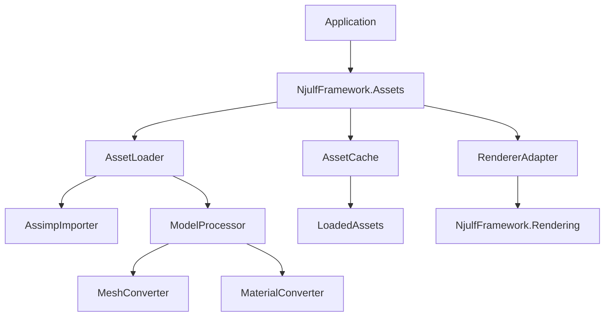
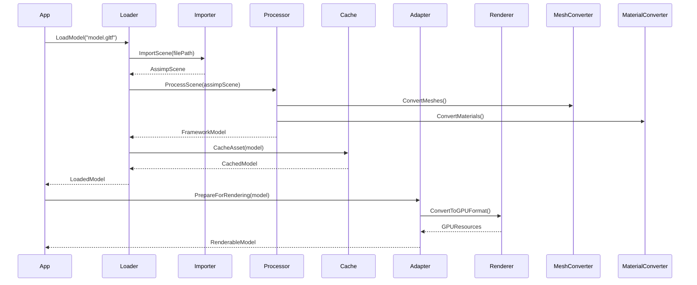

# Asset System Architecture for Njulf Framework

## Overview
This document outlines the architecture for 3D model loading via Silk.NET.Assimp in NjulfFramework.Assets, designed to be decoupled from the renderer while efficiently converting to renderer-compatible types.

## Key Requirements
1. **Decoupling**: The asset system must be independent of the rendering system
2. **Performance**: Efficient loading and conversion of 3D models
3. **Usability**: Simple API for developers to load and use 3D assets
4. **Compatibility**: Support conversion to NjulfFramework.Rendering types

## Architecture Design

### Component Diagram


### Core Components

#### 1. AssetLoader (Main Interface)
- Primary entry point for loading 3D models
- Coordinates the loading pipeline
- Handles file I/O and error management

#### 2. AssimpImporter
- Wraps Silk.NET.Assimp functionality
- Loads models from various formats (GLTF, FBX, OBJ, etc.)
- Provides raw Assimp scene data

#### 3. ModelProcessor
- Processes raw Assimp data into framework-agnostic model representation
- Handles scene hierarchy, meshes, materials
- Optimizes data structures

#### 4. MeshConverter
- Converts Assimp mesh data to NjulfFramework.Rendering.Data.Mesh format
- Handles vertex format conversion
- Calculates bounding boxes

#### 5. MaterialConverter
- Converts Assimp material data to NjulfFramework.Rendering.Data.Material format
- Handles PBR material properties
- Manages texture paths

#### 6. AssetCache
- Caches loaded assets to avoid duplicate loading
- Manages asset lifecycle
- Provides asset reference counting

#### 7. RendererAdapter
- Bridge between Assets and Rendering systems
- Converts asset models to GPU-compatible formats
- Maintains decoupling while enabling efficient rendering

## Data Flow

### Loading Pipeline


## Interfaces and Data Structures

### IAssetLoader Interface
```csharp
public interface IAssetLoader
{
    Task<FrameworkModel> LoadModelAsync(string filePath);
    FrameworkModel GetCachedModel(string filePath);
    void ClearCache();
    event EventHandler<AssetLoadProgress> LoadProgress;
}
```

### FrameworkModel (Asset Representation)
```csharp
public class FrameworkModel
{
    public string Name { get; set; }
    public List<FrameworkMesh> Meshes { get; } = new();
    public List<FrameworkMaterial> Materials { get; } = new();
    public SceneNode RootNode { get; set; }
    
    // Scene hierarchy
    public class SceneNode
    {
        public string Name { get; set; }
        public Matrix4x4 Transform { get; set; }
        public List<SceneNode> Children { get; } = new();
        public List<int> MeshIndices { get; } = new();
    }
}
```

### FrameworkMesh (Renderer-Agnostic Mesh)
```csharp
public class FrameworkMesh
{
    public string Name { get; set; }
    public Vertex[] Vertices { get; set; }
    public uint[] Indices { get; set; }
    public Vector3 BoundingBoxMin { get; set; }
    public Vector3 BoundingBoxMax { get; set; }
    public int MaterialIndex { get; set; }
    
    // Vertex structure matches renderer's Vertex format
    public struct Vertex
    {
        public Vector3 Position;
        public Vector3 Normal;
        public Vector2 TexCoord;
        // Additional attributes as needed
    }
}
```

### FrameworkMaterial (Renderer-Agnostic Material)
```csharp
public class FrameworkMaterial
{
    public string Name { get; set; }
    
    // PBR Properties
    public Vector4 BaseColorFactor { get; set; } = Vector4.One;
    public string BaseColorTexturePath { get; set; }
    public float MetallicFactor { get; set; } = 1.0f;
    public float RoughnessFactor { get; set; } = 1.0f;
    public string MetallicRoughnessTexturePath { get; set; }
    public string NormalTexturePath { get; set; }
    public float NormalScale { get; set; } = 1.0f;
    public string OcclusionTexturePath { get; set; }
    public float OcclusionStrength { get; set; } = 1.0f;
    public string EmissiveTexturePath { get; set; }
    public Vector3 EmissiveFactor { get; set; } = Vector3.Zero;
    
    // Rendering properties
    public AlphaMode AlphaMode { get; set; } = AlphaMode.Opaque;
    public float AlphaCutoff { get; set; } = 0.5f;
    public bool DoubleSided { get; set; } = false;
}
```

## Conversion Process

### To Renderer-Compatible Types
The RendererAdapter handles conversion from Framework types to renderer-specific types:

1. **Mesh Conversion**:
   - FrameworkMesh → RenderingData.Mesh
   - Vertex format is already compatible
   - Bounding box data is preserved

2. **Material Conversion**:
   - FrameworkMaterial → RenderingData.Material
   - PBR properties are directly mapped
   - Texture paths are preserved for texture loading

3. **Scene Conversion**:
   - FrameworkModel → List<RenderObject>
   - Scene hierarchy is flattened or preserved based on needs
   - Transform matrices are calculated

## Performance Considerations

### Loading Optimization
1. **Parallel Processing**: Load meshes and materials in parallel
2. **Caching**: Cache processed models to avoid reloading
3. **Lazy Loading**: Load only visible meshes initially
4. **Background Loading**: Use async loading for large assets

### Memory Management
1. **Vertex Buffer Optimization**: Share vertex data where possible
2. **Texture Atlas**: Combine small textures into atlases
3. **Mesh Deduplication**: Identify and reuse identical meshes
4. **Resource Pooling**: Pool frequently used resources

### GPU Upload Strategy
1. **Staging Buffers**: Use staging buffers for efficient uploads
2. **Batch Uploads**: Group multiple assets for single upload
3. **Async Transfers**: Use transfer queues for non-blocking uploads
4. **Memory Alignment**: Ensure proper alignment for GPU access

## Implementation Plan

### Phase 1: Core Infrastructure
- Implement AssetLoader interface
- Create AssimpImporter wrapper
- Build basic ModelProcessor
- Implement AssetCache

### Phase 2: Conversion Pipeline
- Develop MeshConverter
- Develop MaterialConverter
- Create RendererAdapter
- Implement conversion methods

### Phase 3: Optimization
- Add parallel processing
- Implement caching strategies
- Optimize memory usage
- Add async loading support

### Phase 4: Integration
- Connect with rendering system
- Test with various model formats
- Validate performance
- Document API usage

## Error Handling
- File not found exceptions
- Format compatibility issues
- Memory allocation failures
- GPU resource creation errors
- Provide meaningful error messages
- Graceful fallback mechanisms

## Future Enhancements
- Support for animated models
- LOD (Level of Detail) system
- Procedural generation integration
- Hot-reloading for development
- Asset bundling for distribution