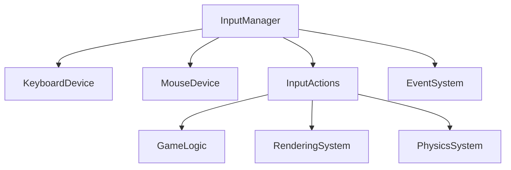

# Input System Architecture

## Overview
The input system for Njulf Framework will provide a simple yet flexible foundation for handling keyboard and mouse input. The design focuses on essential features needed for basic input functionality while ensuring extensibility for future requirements.

## Core Components

### 1. Input Manager
- **Purpose**: Central hub for input handling and state management
- **Responsibilities**:
  - Initialize input devices (keyboard, mouse)
  - Poll device states
  - Process input events
  - Manage input actions
  - Provide frame-to-frame input state

### 2. Input Devices
- **Keyboard Device**: Handles keyboard input including key states and modifiers
- **Mouse Device**: Handles mouse input including position, buttons, and wheel

### 3. Input Action System
- **Purpose**: Abstract input handling through configurable actions
- **Features**:
  - Bind multiple input sources to a single action
  - Support for both immediate and continuous actions
  - Configurable activation thresholds

## Input Action System Design

### Action Types
1. **Immediate Actions**: Triggered instantly when input is detected (e.g., jump)
2. **Continuous Actions**: Provide ongoing values while input is active (e.g., movement)

### Action Configuration
```csharp
public class InputAction
{
    public string Name { get; set; }
    public List<InputBinding> Bindings { get; set; }
    public ActionType Type { get; set; }
    public float Threshold { get; set; } = 0.5f;
}

public class InputBinding
{
    public InputDeviceType Device { get; set; }
    public int KeyCode { get; set; } // For keyboard
    public int Button { get; set; }   // For mouse
    public float Scale { get; set; } = 1.0f;
}
```

### Action Processing
- Input Manager evaluates all bindings for each action
- Combines input values according to bindings
- Applies thresholds and scaling
- Determines if action should trigger

## Public API Structure

### Main API Classes
1. **InputManager**: Primary interface for input system
   - `Initialize()`: Set up input devices
   - `Update()`: Process input for current frame
   - `GetActionState(string actionName)`: Check action status
   - `GetAxis(string actionName)`: Get continuous action value

2. **InputActionBuilder**: Helper for creating input actions
   - `CreateAction(string name, ActionType type)`
   - `AddKeyboardBinding(int keyCode, float scale = 1.0f)`
   - `AddMouseBinding(int button, float scale = 1.0f)`
   - `SetThreshold(float threshold)`

### Example Usage
```csharp
// Initialize input system
var inputManager = new InputManager();
inputManager.Initialize();

// Create jump action
var jumpAction = new InputActionBuilder()
    .CreateAction("Jump", ActionType.Immediate)
    .AddKeyboardBinding(Key.Space)
    .AddMouseBinding(MouseButton.Left)
    .Build();

inputManager.RegisterAction(jumpAction);

// In game loop
inputManager.Update();
if (inputManager.GetActionState("Jump"))
{
    // Jump logic
}
```

## Integration Points

### 1. Framework Core
- Input system integrates with main application loop
- Requires `Update()` call each frame
- Provides input state to other systems

### 2. Rendering System
- Mouse position used for camera control
- Keyboard input for scene navigation
- Input actions trigger rendering changes

### 3. Physics System
- Input actions drive physics simulations
- Continuous actions provide movement forces
- Immediate actions trigger physics events

### 4. Event System
- Input actions can trigger framework events
- Input state changes broadcast as events
- Other systems subscribe to input events

## Implementation Plan

### Phase 1: Core Input Handling
1. Implement InputManager base class
2. Create KeyboardDevice and MouseDevice
3. Add basic input polling and state tracking

### Phase 2: Input Action System
1. Implement InputAction and InputBinding classes
2. Create action evaluation logic
3. Add action registration and management

### Phase 3: Framework Integration
1. Connect input system to main application loop
2. Add input event broadcasting
3. Create integration points with other systems

## Design Considerations

### Simplicity
- Focus on essential features only
- Avoid over-engineering for future requirements
- Keep API straightforward and intuitive

### Extensibility
- Design interfaces to allow future device types
- Make action system configurable
- Ensure clean separation of concerns

### Performance
- Minimize input processing overhead
- Use efficient data structures for device states
- Optimize action evaluation

## Mermaid Diagram



## Conclusion

This architecture provides a solid foundation for input handling in Njulf Framework. It focuses on the essential requirements while maintaining flexibility for future expansion. The design emphasizes simplicity, performance, and clean integration with the existing framework components.